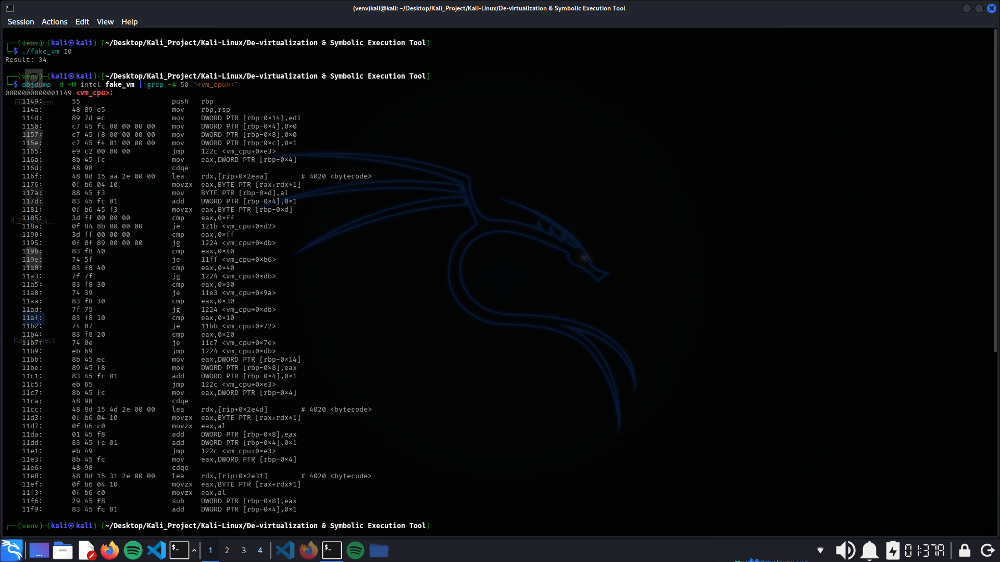
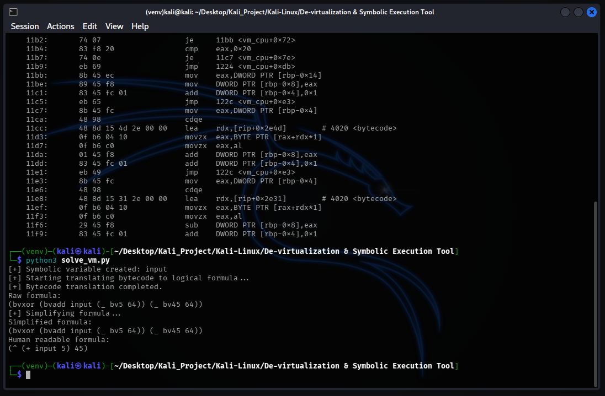

# Symbolic Execution De-virtualizer

## Overview

Symbolic Execution De-virtualizer is a Reverse-Engineering tool designed to tackle code-virtualization,a sophisticated protection technique often used by advanced malware and commercial packers (e.g., VMProtect, Themida). In virtualization-based obfuscation, the original machine code is translated to a custom bytecode, which then executed by an internal custom-build CPU transforming simple logic to a complex unreadable spaghetti code that defeats static analysis. This project implements a symbolic execution engine that "lifts" the obfuscated bytecode to an abstract syntax tree (AST) and utilizes the Z3 theorem prover to mathematically simplify the logic back to human-readable format.

## Key Features

### 1. Symbolic Lifting

* Uses Triton DBA framework to translate raw binary opcodes into an Abstract Syntax Tree (AST).
* Abstracts away the custom architecture (virtual CPU) to focus purely on the data flow and logic.

### 2. Automated Simplification

* Leverages Z3 Theorem Prover to perform logic minimization on the extracted AST.
* Automatically removes dead code, intermediate virtual registers, and useless instructions, leaving only the core logic.

### 3. Algebraic Reconstruction

* Implements a custom output parser to convert SMT-LIB formulas into standard algebraic notation.
* Displays the final logic in a Prefix format

## Architecture

1.  **Trace Analysis**

    - Reads the target bytecode array.
    - Initializes a symbolic context to track the state of virtual registers.

2.  **Symbolic Execution (Lifting)**

    - Iterates through the bytecode instructions (Fetch-Decode-Execute simulation).
    - Builds a chain of symbolic expressions instead of calculating concrete values.

3.  **Logic Synthesis (Solving)**

    - Passes the complex AST to the Z3 Solver.
    - Computes the simplified logical equivalent and outputs the final clean formula.

## Demo & Proof of Concept

### 1. The Challenge

The input is 10 and the result is 34,how? Inspecting with `objdump -d -M intel fake_vm | grep -A 50 "<vm_cpu>:"` the logic is hidden and we can only see a complex and random output,making manual reverse engineering dificult.

### 2. Solution

By running `solve_vm.py` it performs a symbolic execution over the bytecode and succesfully ignores the complex control flow and extracts the core logic.

## Prerequisites

* Python 3+
* Triton Library
* Z3 Solver

---
* Created by : Yustinus Hendi Setyawan
* Date : Friday, January 15 2026