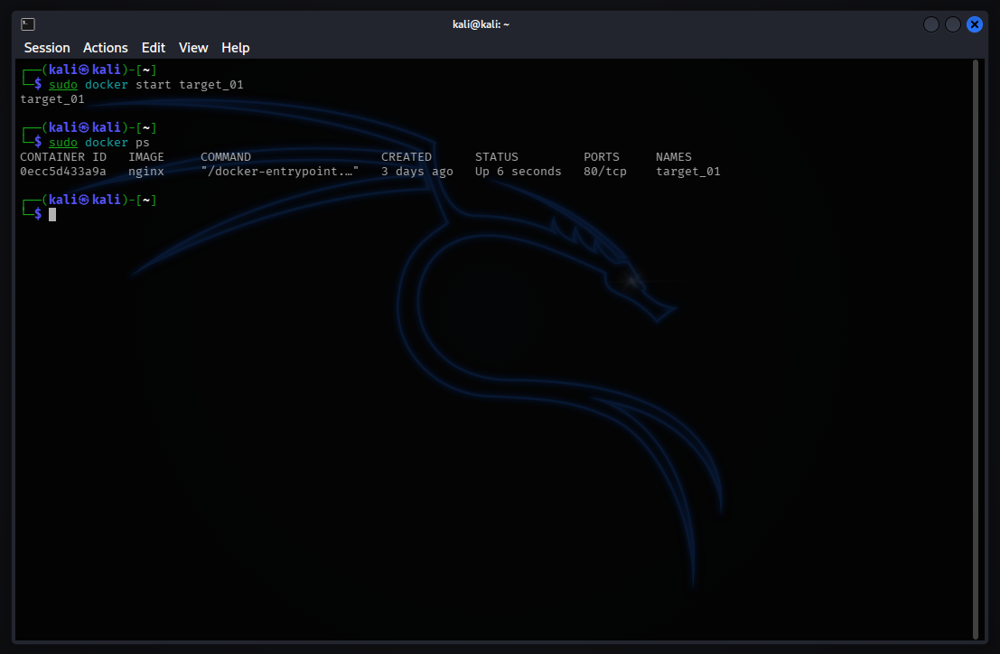
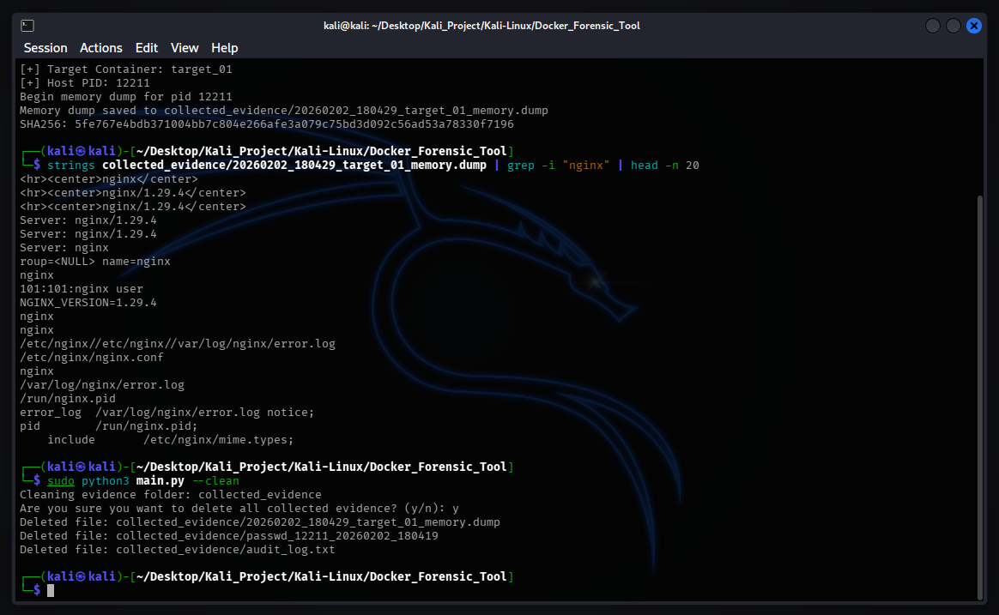

# Docker Forensic Tool

## Overview

Docker Forensic Tool is an agentless Digital Forensics & Incident Response (DFIR) utility designed to extract volatile evidence from compromised Docker containers without triggering the "Observer Effect." In traditional container forensics, executing commands like `docker exec` can alter timestamps, overwrite memory, or trigger malware self-destruct mechanisms. This tool solves that problem by leveraging the Host OS kernel capabilities (specifically `/proc` filesystem and `gcore`) to "peek" inside the container's isolated namespace. It allows security analysts to extract files and dump process memory (RAM) directly from the host, preserving the integrity of the evidence.

## Key Features

### 1. Agentless Artifact Collection
* Bypasses the need to install tools inside the victim container.
* Accesses the container's file system directly via the Host Kernel's `/proc/[pid]/root` path.
* Safe to use even on compromised containers with broken or malicious binaries.

### 2. Live Memory Dumping
* Utilizes `gcore` (GNU Debugger) to snapshot the container's RAM without stopping the service.
* Critical for retrieving encryption keys, plaintext passwords, and fileless malware artifacts.

### 3. Forensic Integrity & Auditing
* Automatically calculates SHA256 hashes for every extracted artifact immediately upon collection.
* Maintains a "Chain of Custody" via an immutable `audit_log.txt` that records timestamps, source paths, and file hashes.

## Architecture

1.  **Namespace Discovery**
    * Queries the Docker API to translate the Container ID into the Host Process ID (PID).
    * Identifies the isolation boundaries (Mount Namespace).

2.  **Evidence Extraction**
    * Copies target files (e.g., `/etc/passwd`) using the kernel's virtual filesystem bridge, ensuring read-only access.
    *Suspends the process for milliseconds to dump the Virtual Memory Area (VMA) to disk.

3.  **Sanitization**
    * Includes a secure cleanup module to remove sensitive evidence from the analyst's machine after the investigation is complete.

## Demo & Proof of Concept

### 1. Target Identification
The tool identifies the running container (`target_01`) and maps it to the underlying Host PID (`12211`) to prepare for extraction.

### 2. Artifact Collection & Memory Dumping
Here, we successfully extract the `/etc/passwd` file and perform a full RAM dump. Notice the SHA256 hash is generated instantly to prove integrity.

### 3. Analysis & Cleanup
Using `strings` on the generated `.dump` file reveals runtime data (Nginx configuration and version) that resides only in RAM. The cleanup command ensures no sensitive data is left on the analyst's machine.

## Prerequisites

* Linux
* Python 3+
* docker.io
* gdb
* Root access

---
* Created by: Yustinus Hendi Setyawan
* Date: Friday, January 30 2026