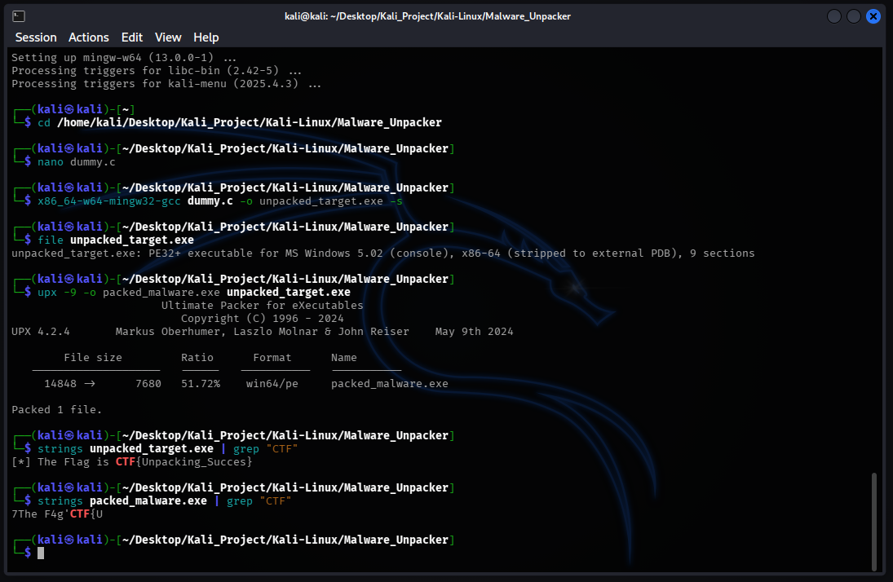
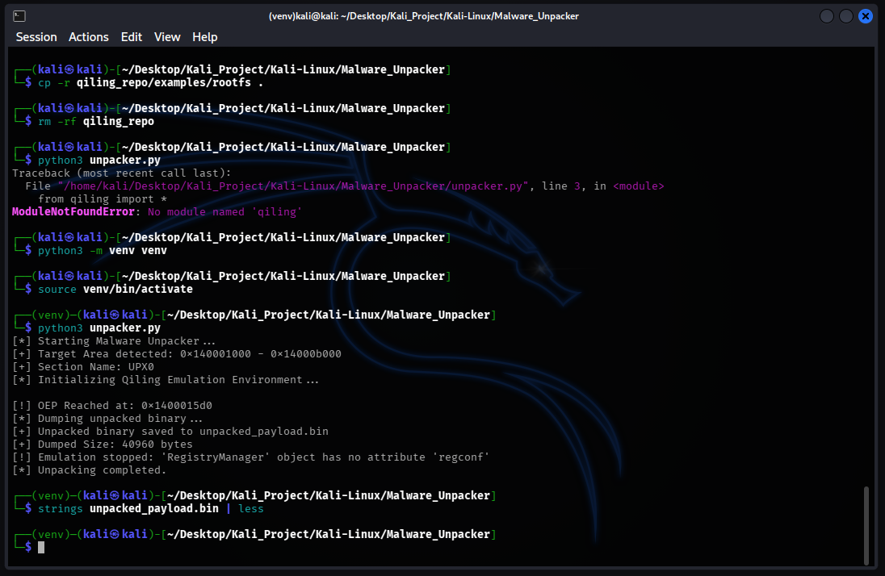
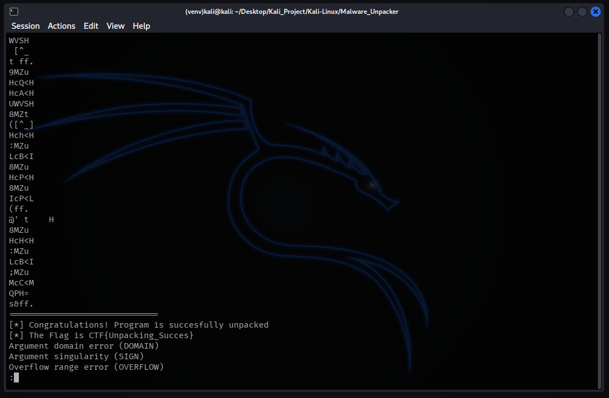
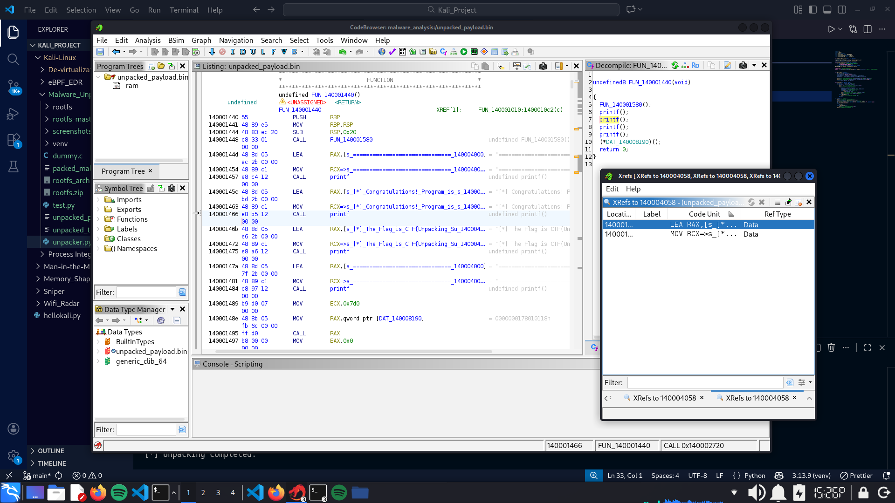

# Qiling Malware Unpacker

## Overview

Qiling Malware Unpacker is a dynamic analysis tool designed to automatically unpack executable files protected by packers like UPX. Traditional static analysis often fails against packed binaries because the malicious payload is compressed or encrypted. This tool utilizes the Qiling Framework to emulate the binary's execution in a controlled environment, detect the Original Entry Point (OEP) dynamically, and dump the decrypted payload from memory back to disk for further analysis. It features a custom mechanism to bypass Qiling's strict dependency checks like registry and import table, making it lightweight and effective against standard packing techniques.

## Key Features

### 1. Dynamic OEP Detection
* Uses execution emulation to track the Instruction Pointer (RIP).
* Automatically detects when execution jumps from the packer section (e.g., `UPX0`) to the real code section, marking the end of the unpacking routine.

### 2. Automated Memory Dumping
* Once the OEP is reached, the tool calculates the size of the unpacked section.
* Extracts the raw binary code directly from the emulated memory and saves it as `unpacked_payload.bin`.

### 3. Stability Patching
* Implements runtime patching for Qiling's `RegistryManager` and `Pe.init_imports`.
* Prevents emulation crashes caused by missing system files or corrupted Import Tables common in malware samples.

## Architecture

1.  **Initialization**

    - Loads the target packed binary (`packed_malware.exe`) into the Qiling emulator.
    - Applies patches to bypass Windows Registry and Import Table errors.

2.  **Emulation & Hooking**

    - Hooks every code execution block.
    - Monitors the `RIP` register to see if it enters the address range of the original code section.

3.  **Extraction**

    - Upon detecting the jump to OEP, execution is paused.
    - The tool reads the memory content of the unpacked section and writes it to a file.

## Demo & Proof of Concept

### 1. The Challenge
To simulate a real-world scenario, a C program containing a hidden flag `CTF{Unpacking_Succes}` was created. It was then compiled and packed using `UPX`. As shown below, running `strings` on the packed file fails to reveal the flag, simulating how malware hides its secrets.

### 2. Execution
Running the tool performs a complete emulation. The script successfully identifies the transition from the packer stub to the actual payload at address `0x1400015d0` and dumps 40KB of unpacked data.

### 3. Verification
Inspecting the resulting `unpacked_payload.bin` reveals the hidden data. The flag `CTF{Unpacking_Succes}` is now clearly visible in plaintext, proving the unpacking was successful.

### 4. Analysis
Using Ghidra for full logic reconstruction. We can see the recovered Assembly instructions and the decompiled C code, confirming the program's logic and the location of the flag in memory.

## Prerequisites

* Python 3+
* Qiling Framework 
* Pefile 

---
* Created by : Yustinus Hendi Setyawan
* Date : Friday, January 16 2026