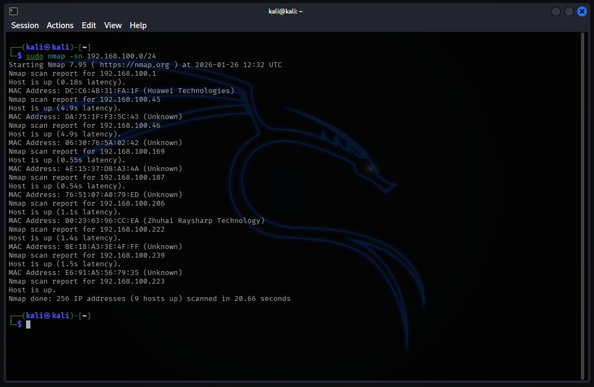
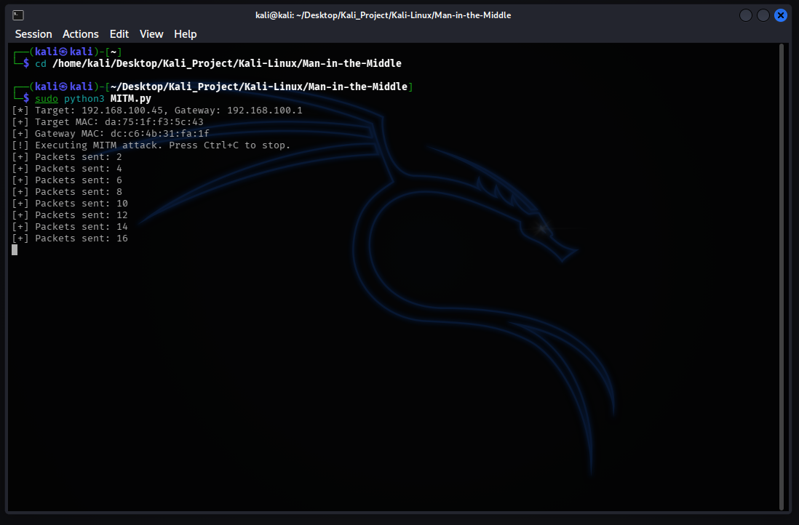
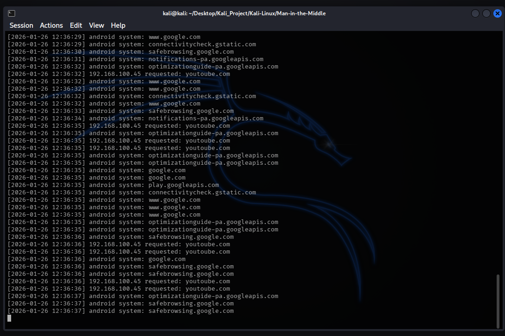

# Man-in-the-Middle (MITM) Framework

## Overview

MITM Framework is a Python-based network offensive tool designed to intercept, manipulate, and monitor traffic within a local area network (LAN). It leverages the ARP Spoofing technique to redirect victim traffic through the attacker's machine, effectively positioning the attacker as a "Man-in-the-Middle" between the victim and the gateway. This tool demonstrates how insecure protocols (like ARP and HTTP) can be exploited to perform surveillance and session hijacking without physical access to the target device.

Note: I have to censor some sensitive info like ip addresses and mac addresses as an act of prevention in case some unresponsible individuals tries to exploit it

## Key Features

### 1. ARP Poisoning Engine
* Sends continuous forged ARP replies to both the Victim and the Gateway.
* Fools the victim into believing the Attacker is the Router, and fools the Router into believing the Attacker is the Victim.
* Includes a Restore Mechanism to reset the network tables (`ARP Restore`) upon exit, preventing permanent connectivity loss for the victim.

### 2. DNS Surveillance Logger
* Real-time packet sniffer that filters DNS queries (`UDP Port 53`).
* Logs every website visited by the victim with precise timestamps.
* Distinguishes between standard web traffic and system background processes (e.g., Android system updates).

### 3. Network Reconnaissance
* Integrated with `Nmap` or `Netdiscover` to map out live hosts on the subnet.
* Identifies targets by MAC Address vendors (e.g., detecting Huawei or Samsung devices) to ensure precise targeting.

## Architecture

1.  **Reconnaissance Phase**
    * Scanning the network to identify the Target IP and Gateway IP.

2.  **Poisoning Phase**
    * **Target:** Tells victim "I am the Router".
    * **Gateway:** Tells router "I am the Victim".
    * Enables `IP Forwarding` on the attacker machine to maintain the victim's internet connection.

3.  **Sniffing Phase**
    * Captures traffic flowing through the attacker's interface.
    * Parses DNS headers to extract requested domain names.

## Demo & Proof of Concept

### 1. Network Reconnaissance
Using `nmap` to scan the subnet and identify potential targets. The scan reveals active hosts.

### 2. Launching the Attack
Executing `MITM.py` to start the ARP Spoofing process. The tool automatically resolves MAC addresses and begins sending spoofed packets to the Target and Gateway.

### 3. Traffic Interception (DNS Logger)
While the attack is running, `dns_logger.py` captures the victim's browsing activity in real-time. As shown below, the logger successfully detects requests to `google.com`, `youtube.com`, and Android system services from the target device.

## Prerequisites

* Linux
* Python 3+
* Nmap/netdiscover

---
* Created by: Yustinus Hendi Setyawan
* Date: Wednesday,January 07 2026