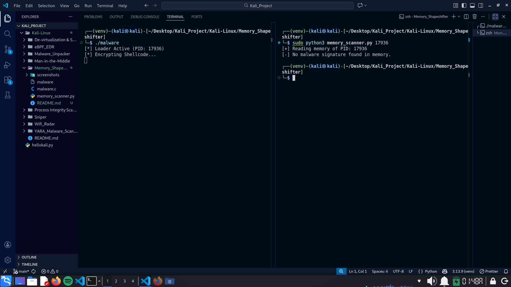
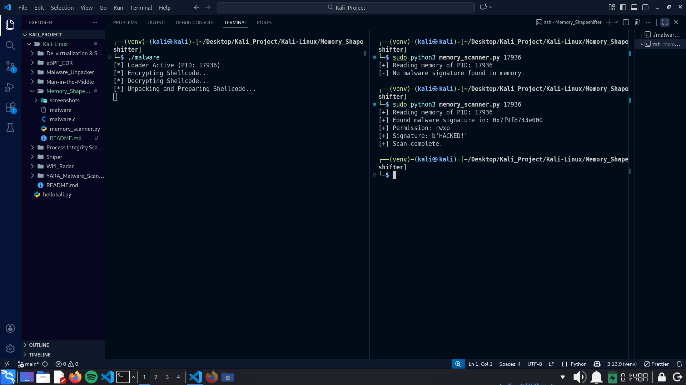

# Runtime Encryption Lab

## Overview

This project is a Proof-of-Concept (PoC) research project exploring advanced evasion techniques used by modern malware to bypass antivirus detection. In traditional AV scanning, signatures are matched against files on disk. Advanced malware avoids this by encrypting its payload and only decrypting it in RAM right before execution. This project simulates that behavior using a custom C loader and demonstrates how to detect it using a Python-based memory forensics tool.

## Key Features

### 1. Runtime Polymorphism
* The loader (`malware.c`) allocates a memory region and immediately XOR-encrypts its own shellcode.
* The program sleeps for 15 seconds while encrypted, mimicking benign behavior to trick heuristic scanners.
* The payload is decrypted only milliseconds before execution, minimizing the exposure window.

### 2. Live Memory Forensics
* The scanner (`memory_scanner.py`) bypasses the file system and reads directly from the process's virtual memory via Linux's `/proc` filesystem.
* Scans the `RWX` (Read-Write-Execute) memory pages of a running process to find the unpacked signature (`HACKED!`).

## Architecture

1.  **The Loader**
    * Allocates RWX memory using `mmap`.
    * Copies the shellcode into the allocated space.
    * Encrypts the memory (XOR `0xAA`) -> Signature Hidden.
    * Sleeps.
    * Decrypts the memory -> Signature Visible.
    * Executes the payload.

2.  **The Scanner**
    * Parses `/proc/{PID}/maps` to identify memory regions.
    * Filters for regions with write/execute permissions.
    * Seeks into `/proc/{PID}/mem` and scans for the malicious pattern.

## Demo & Proof of Concept

### 1. Evasion
The malware loader is started (PID: 17936). It encrypts its payload and goes to sleep.
When we run the scanner immediately, NO signature is found. The memory contains random XORed bytes, successfully evading detection.

### 2. Detection
After the sleep timer expires, the loader decrypts the payload to prepare for execution.
Running the scanner now successfully detects the malware signature in memory address `0x7...`, proving that the payload is now exposed.

## Prerequisites

* Linux
* GCC Compiler
* Python 3+
* Root Privilege

---
Created by: Yustinus Hendi Setyawan
Date: Friday, January 09 2026