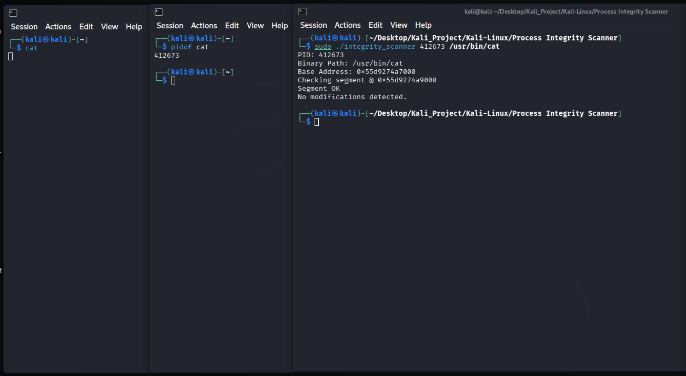
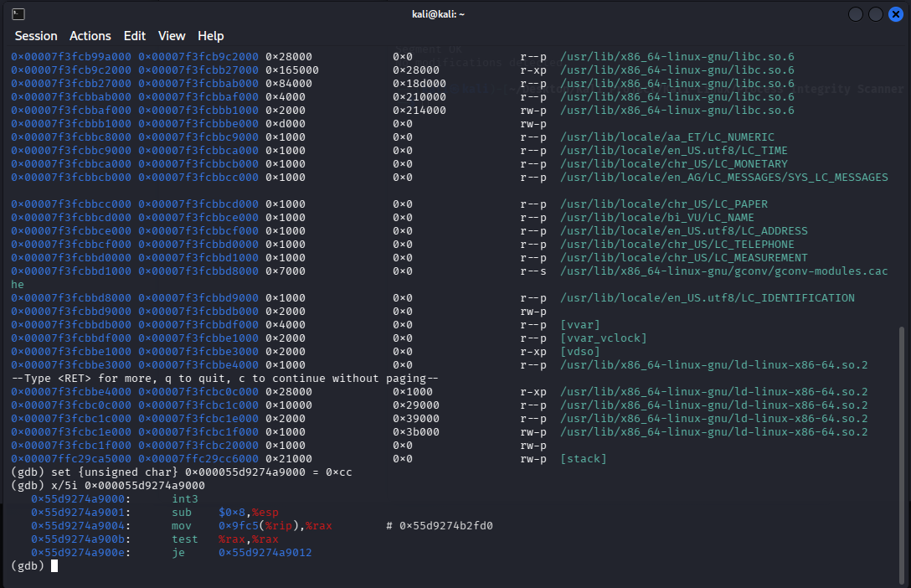

# Linux Runtime Integrity Scanner


Disclaimer!
This tool is developed for educational purpose only, It is intended to demonstrate memory forensic concepts.

## Overview

Linux Runtime Integrity Scanner is a simple C-based memory forensic tool to detect in-memory code modification and process injection in real-time. 
Modern malware and advance threats often utilize techniques like Process-Hollowing or Reflective Code Loading to modify legitimate process's memory without changing the file on the disk and standard anti-virus often missed these volatile threats.
This tool is designed to bridge that gap by performing byte-per-byte comparison between the active process memory and its original binary executable on the disk.

## Key Features

### 1. ELF Binary Analysis

* Parses ELF-64 headers to automatically locate the `.text` segment
* Extracts critical metadata such as entry points, program headers, and segment offsets directly from binary file.

### 2. ASLR Resolution

* Dinamycally resolve Address Space Layout Randomization (ASLR) by parsing `/proc/[PID]/maps`.
* Calculates exact virtual memory address of the target segment, ensuring accurate reading regardless of OS memory randomization.

### 3. Forensic Visualization

* Implements a custom Hexdump Engine to visualize detected anomalies.
* Highlights injected or modified bytes in red for easy spotting.

## Architecture

1. **Disk Analysis**

    - Opens the target binary path (e.g, `/usr/bin/cat`).
    - Reads the `Elf64_Phdr` to find segments marked with `PT_LOAD` and `PF_X`

2. **Memory Mapping**

    - Reads `/proc/[PID]/maps` to find the base address
    - Computes the absolute virtual address: `Target_Addr = Base_Addr + Segment_Offset`.

3. **Integrity Verification**

    - Reads live memory buffer via `/proc/[PID]/mem`.
    - Performs a `memcmp` againts the disk buffer.
    - Triggers forensic dump once a mismatch occurs.

## Demo & Proof of Concept

### 1. Baseline (Clean State)

Scanning a legitimate `cat` process, and the tool confirms that the memory match the disk binaries.



### 2. Attack Simulation

Using GDB (GNU Debugger) to manually overwrite the process memory with `0xCC` simulating a malware hook.

```bash
(gdb) set {unsigned char}0x000055d9274a9000 = 0xcc
```



### 3. Final Scan (Attacked State)

The tool manage to capture the mismatch and triggers the forensic dump.


## Prerequisites

* Linux (Kali/Ubuntu/Debian)
* GCC compiler
* Root Privileges

---
* Created by : Yustinus Hendi Setyawan
* Date : Friday, January 14 2026