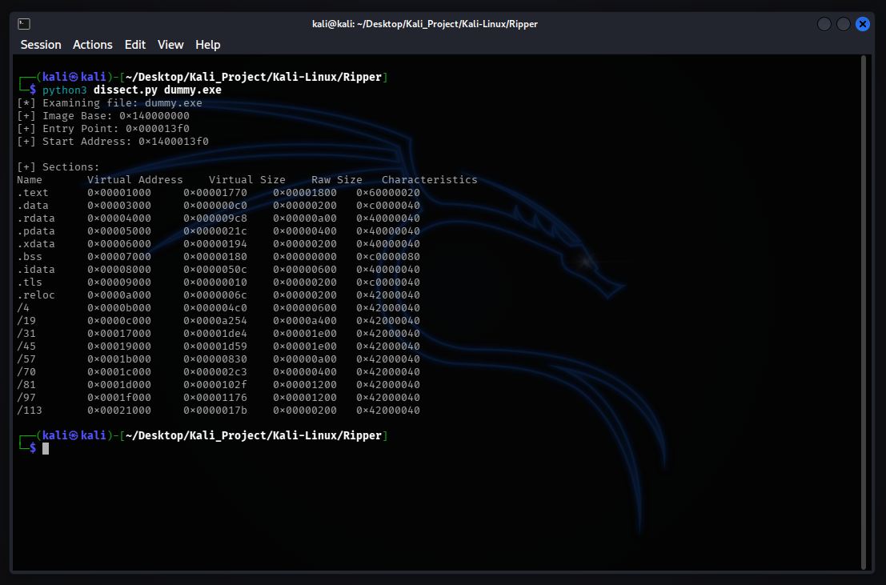
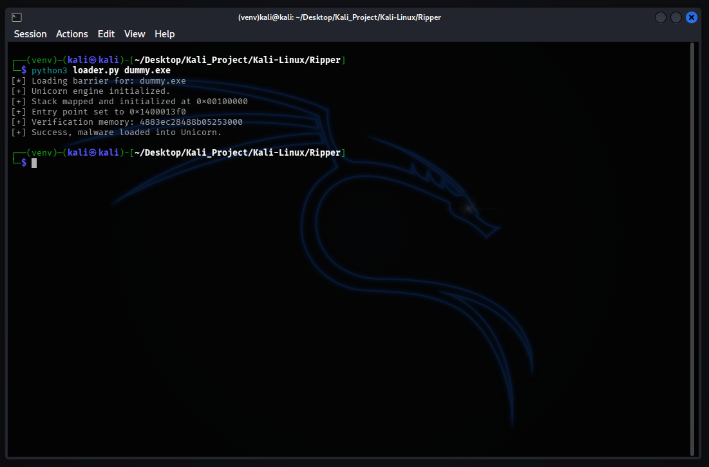
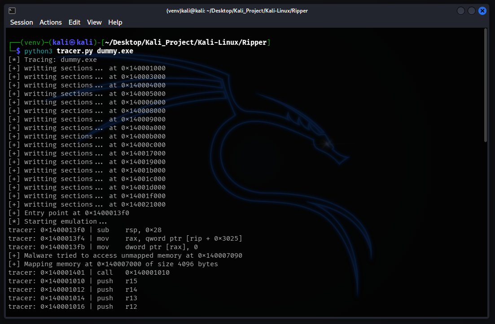
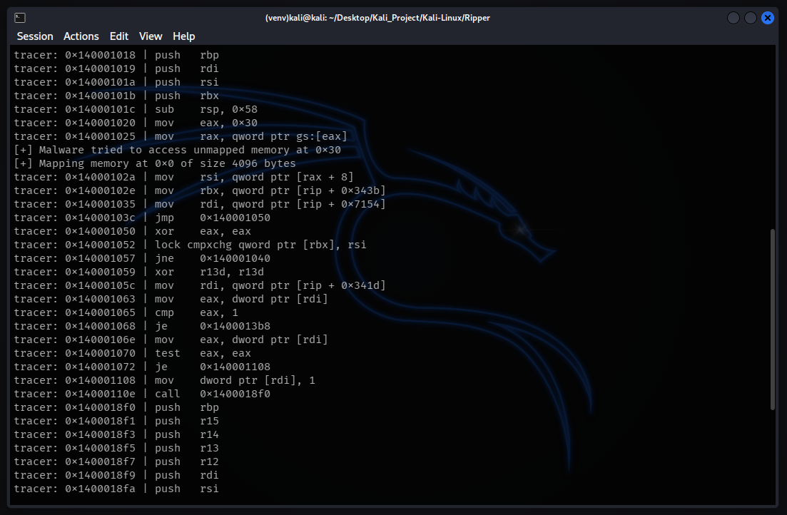
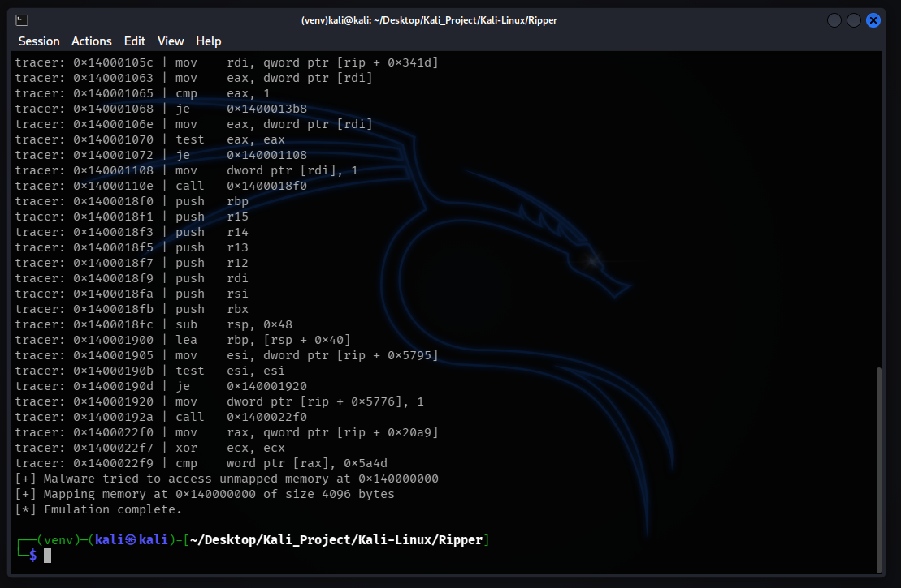
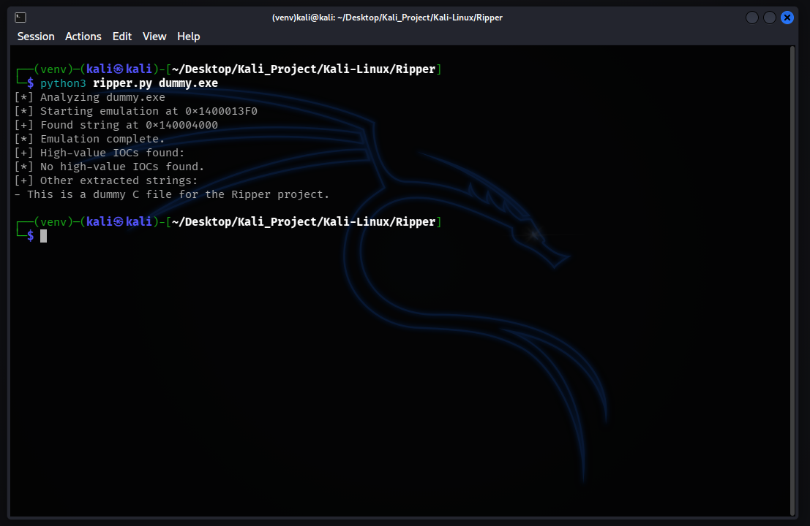
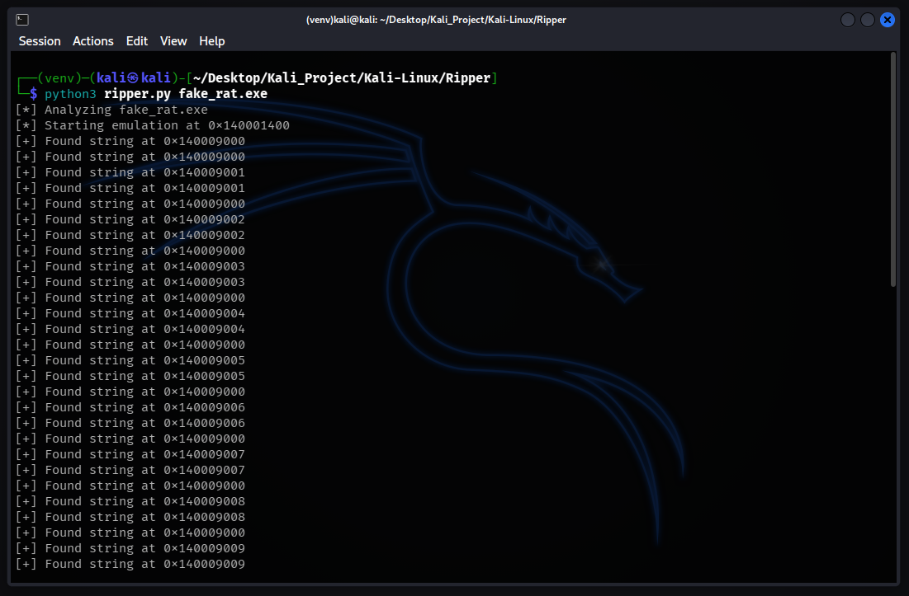
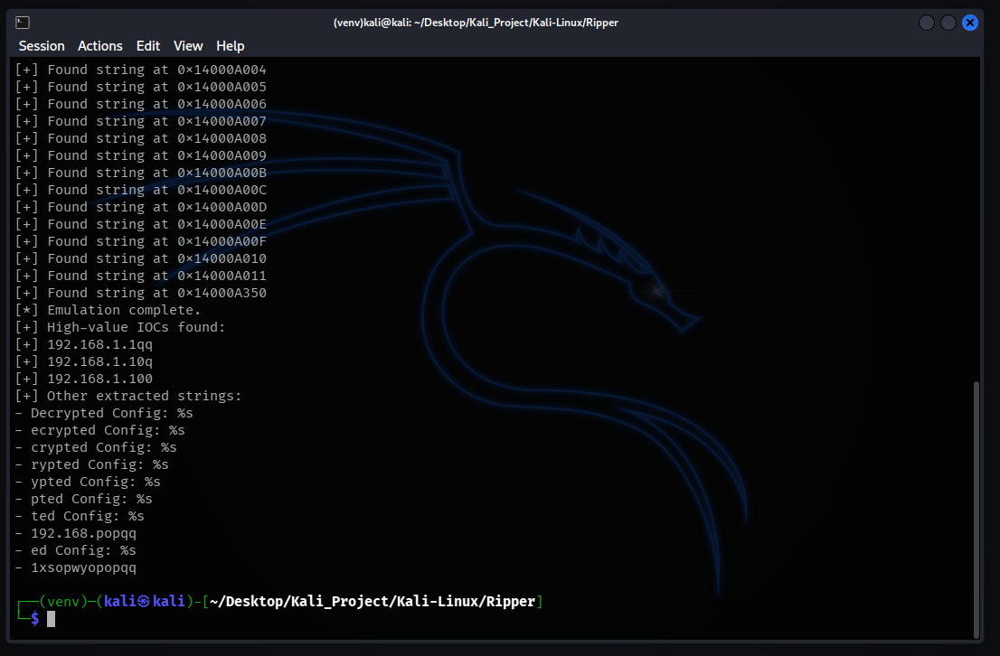

# Automated Malware Config Extractor

## Overview

The Ripper is a Malware Analysis tool designed to tackle obfuscated configuration data, a technique commonly used by modern RATs (Remote Access Trojans) and Stealers to hide their C2 (Command & Control) infrastructure. In standard malware development, sensitive strings like IP addresses are encrypted (XOR, RC4, AES) and only decrypted during runtime in the system memory. This defeats static analysis tools like `strings`. This project implements a CPU emulation engine that "tricks" the malware into executing its decryption routine in a safe, isolated virtual memory, and automatically extracts the decrypted Indicators of Compromise (IOCs) from CPU registers.

## Key Features

### 1. Safe Emulation

* Uses Unicorn Engine to emulate x86/x64 machine code in a virtual container.
* Abstracts away the Host OS, allowing the malware to execute critical logic without infecting the analyst's machine.

### 2. Auto-Healing Memory Engine

* Implements a heuristic "Healer" that detects when malware attempts to call missing Windows APIs.
* Automatically patches the memory with `RET` instructions in real-time, preventing crashes and allowing the decryption routine to finish.

### 3. Heuristic Config Extraction

* Monitors CPU registers (`RAX`, `RBX`, `RCX`, etc.) at every execution step.
* Utilizes Regex pattern matching to automatically filter and extract high-value artifacts (IP Addresses, URLs) from the memory stream.

## Architecture

1.  **Dissection & Loading**

    - Parses the PE Header to identify Code Sections and Entry Points.
    - Maps the binary sections into a virtual memory space initialized by Unicorn.

2.  **Emulated Execution**

    - Iterates through the assembly instructions (Fetch-Decode-Execute simulation).
    - Hooks memory access violations to handle API calls dynamically.

3.  **Exfiltration**

    - Scans memory writes and register values during the execution.
    - Filters the output to identify readable strings and valid IOC patterns.

## Demo & Proof of Concept

### Static Analysis (Dissection)
Before emulation, the tool inspects the target binary structure to determine the Image Base, Entry Point, and Section characteristics (`.text`, `.data`, `.rdata`).

### Loading the Sandbox
The engine initializes a virtual container, mapping the stack and memory barriers to ensure the malware cannot escape or consume excessive resources.

### Instruction Tracing
The tool hooks into the execution flow. Below, we can see the emulator tracing memory mapping and individual assembly instructions (`MOV`, `PUSH`, `SUB`) in real-time.

**3.1. Mapping Sections**

**3.2. Execution Flow Analysis**

**3.3. Deep Instruction Trace**

### Validation
Testing the extraction engine on a non-obfuscated dummy file (`dummy.exe`) to ensure the string extraction logic is working correctly before moving to complex targets.

### The Challenge
`fake_rat.exe` sample was created with an XOR-encrypted C2 IP Address. Static analysis tools failed to see the IP.

**5.1. Real-Time Decryption Capture**
As the malware executes its XOR routine, The Ripper captures the intermediate states in memory. We can see the "garbage" data transforming into readable text frame-by-frame.

**5.2. Final Intelligence Report**
The Ripper successfully filters the noise and extracts the final IOC: `192.168.1.100`.

## Prerequisites

* Python 3+
* Unicorn Engine
* Capstone Engine
* Pefile Library

---
* Created by : Yustinus Hendi Setyawan
* Date : Saturday, February 07 2026