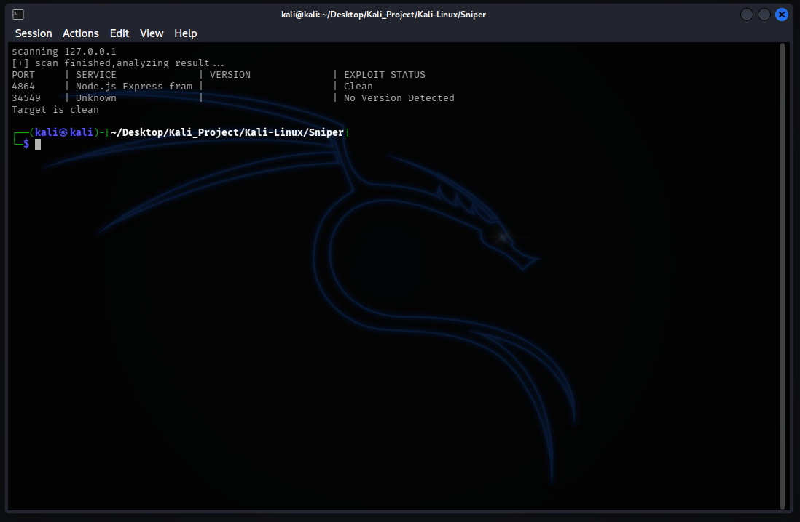

# Automated Vulnerability Scanner

## Overview

This tool is an automated reconnaissance and vulnerability scanning tool designed to bridge the gap between service discovery and exploitation. Instead of manually running `nmap` and then individually searching for exploits for each detected service, this tool automates the entire workflow. It scans the target for open ports, identifies running service versions, and immediately cross-references them against the local Exploit-DB archive using `searchsploit` to flag potential vulnerabilities in real-time.

## Key Features

### 1. Automated Enumeration
* Leverages `Nmap` (`-sV -p- --min-rate 1000`) to rapidly scan all 65,535 ports and fingerprint service versions.
* Automatically parses Nmap's XML output to extract structured data (Port, Product, Version) without human intervention.

### 2. Intelligent Exploit Mapping
* For every identified service (e.g., `vsftpd 2.3.4`), Sniper automatically queries the `Exploit-DB` offline database (`searchsploit`) to check for known CVEs or exploit scripts.
* Instantly tags services as "Potential Exploit Found!" or "Clean" in the console output.

### 3. Reporting & Logging
* Displays a neat, real-time table summarizing the security posture of the target.
* Automatically saves detailed exploit metadata (paths to exploit scripts, CVE details) into a log file (`rsniper_result.txt`) for further analysis.

## Architecture

1.  **Scanner Phase**
    * The Python wrapper executes Nmap to scan the target IP and generates a temporary `result.xml`.
2.  **Parser Phase**
    * The script processes the XML tree to find `open` ports and extracts the `product` and `version` attributes.
3.  **Hunter Phase**
    * It constructs a query string (e.g., "Apache 2.4.49") and feeds it into `searchsploit`.
    * If the output contains an exploit title, it flags the service as vulnerable and logs the findings.

## Demo & Proof of Concept

### 1. Running the scanner
Execute the script with root privileges (required for Nmap OS fingerprinting) and the target IP.

## Prerequisites

* Linux
* Root Privilege

---
Created by: Yustinus Hendi Setyawan
Date: Tuesday, January 6 2026