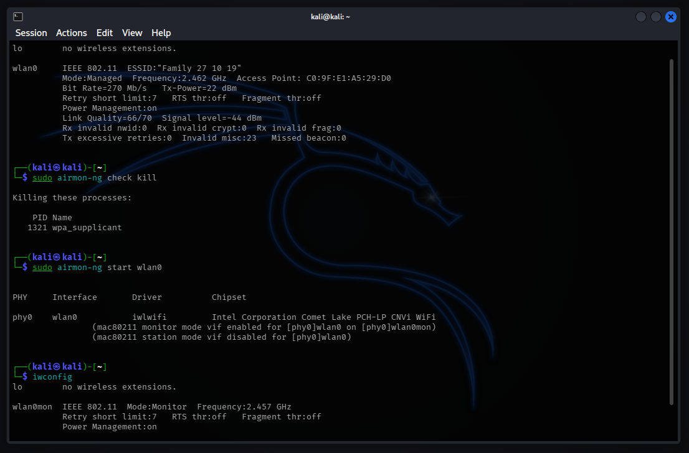
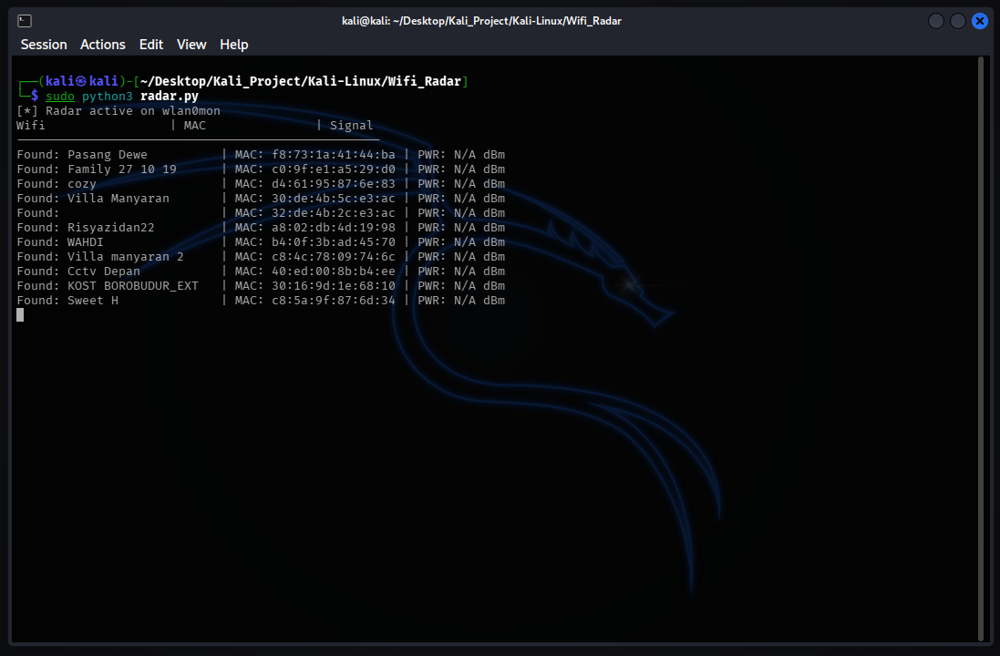

# Wireless Reconnaissance Tool

## Overview

This tool is a lightweight wireless reconnaissance tool designed to map the surrounding radio frequency (RF) landscape. Unlike standard WiFi scanners that only check the currently tuned channel, this tool implements Automated Channel Hopping to sweep the entire 2.4GHz spectrum in real-time. It leverages the `Scapy` library to intercept raw `Dot11Beacon` frames from Access Points (APs), extracting critical metadata such as SSID, BSSID (MAC Address), and Signal Strength (RSSI) to identify nearby networks, including those not broadcasting their SSID.

## Key Features

### 1. Full Spectrum Sweep
* Implements a dedicated thread that rapidly switches the WiFi adapter's channel every 0.5 seconds.
* Ensures detection of all APs in the vicinity, not just those on the default channel.

### 2. Raw Beacon Analysis
* Operates in Monitor Mode to capture raw 802.11 management frames.
* Parses `Dot11Elt` layers to decode network names and signal metrics directly from the airwaves.

### 3. Real-Time Signal Meter
* Displays the Received Signal Strength Indicator (RSSI) in dBm.
* Useful for "Warwalking" or physical proximity testing to locate rogue Access Points.

## Architecture

1.  **The Hopper**
    * Uses Linux `iw` commands to mechanically retune the radio frequency of the interface (`wlan0mon`) in a continuous loop.

2.  **The Sniffer**
    * A Scapy-based listener that captures packets promiscuously.
    * Filters for Beacon Frames (Type 0, Subtype 8) to identify announcing APs.
    * De-duplicates results to maintain a clean list of unique targets.

## Demo & Proof of Concept

### 1. Initialization
The tool is launched on the monitoring interface (`wlan0mon`). The Channel Hopper thread starts silently in the background, ensuring the adapter is constantly moving across frequencies.

### 2. Active Scanning
As the tool runs, it populates the table with detected Access Points. It successfully captures details like the MAC Address (BSSID) and Signal Strength (PWR), providing a live view of the wireless environment. But unfortunately i had to censored both the Wifi name and the mac address as a prevention in case some unresponsible individuals tried to exploit it.

## Prerequisites

* Linux
* Scapy library

---
Created by: Yustinus Hendi Setyawan
Date: Tuesday, January 6 2026