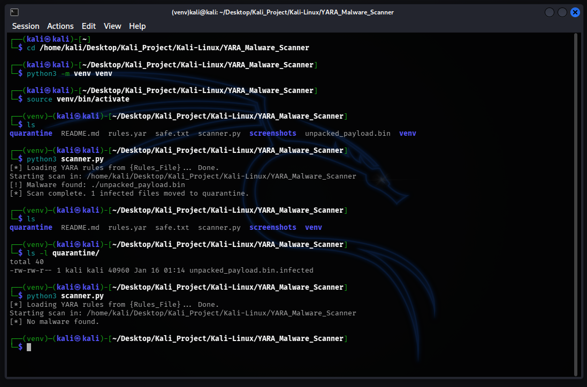

# Automated Malware Triage System

## Overview

This project is a Signature-Based Malware Detection Engine built with Python and YARA. It serves as the defensive counterpart to the previous [Malware Unpacker](https://github.com/uusrajaminyak/Kali-Linux/tree/main/Malware_Unpacker) project. While the Unpacker was designed to reveal hidden payloads, this scanner is designed to hunt them down. It scans directories recursively, identifies files matching specific malicious patterns, and automatically isolates them to prevent execution.

## Key Features

### 1. Custom Signature Database `rules.yar`
* Uses YARA rules to define malware characteristics.
* Specifically tuned to detect the artifact `CTF{Unpacking_Succes}` and specific hex patterns from unpacked binaries.

### 2. Automated Scanning Engine
* Walks through the filesystem to inspect files in real-time.
* Filters out safe files and focuses on identifying threats based on the loaded rule set.

### 3. Immediate Quarantine
* Upon detection, the script immediately moves the malicious file to a localized `quarantine/` directory.
* Appends the `.infected` extension to render the file inert (non-executable) and safe for further forensic analysis.

## Architechture

1.  **Initialization** 

    - The script compiles the `rules.yar` database.

2.  **Hunting** 

    - It iterates through the target directory.

3.  **Matching** 

    - Each file is scanned against the YARA signatures.

4.  **Response**

    - Alert triggered -> File Moved to Quarantine -> Event Logged.
    - No Match File = ignored.

## Demo & Proof of Concept

The screenshot below demonstrates the tool in action against a directory containing the `unpacked_payload.bin` malware.

1.  First Run,The scanner detects the malware based on the "CTF Flag" signature and moves it to the quarantine folder.
2.  Listing the `quarantine/` directory confirms the file has been secured as `unpacked_payload.bin.infected`.
3.  Second Run, The directory is now clean.

## Prerequisites

* Linux
* Python 3+
* YARA library

---
* Created by : Yustinus Hendi Setyawan
* Date : Monday, January 19 2026