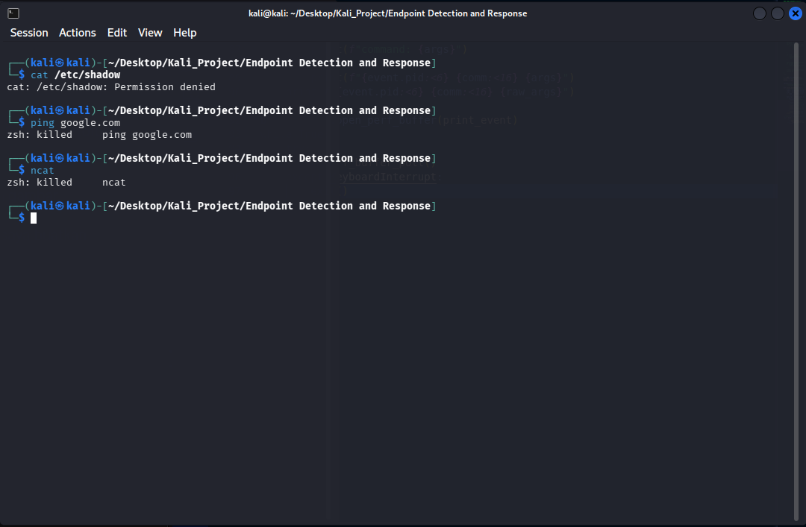
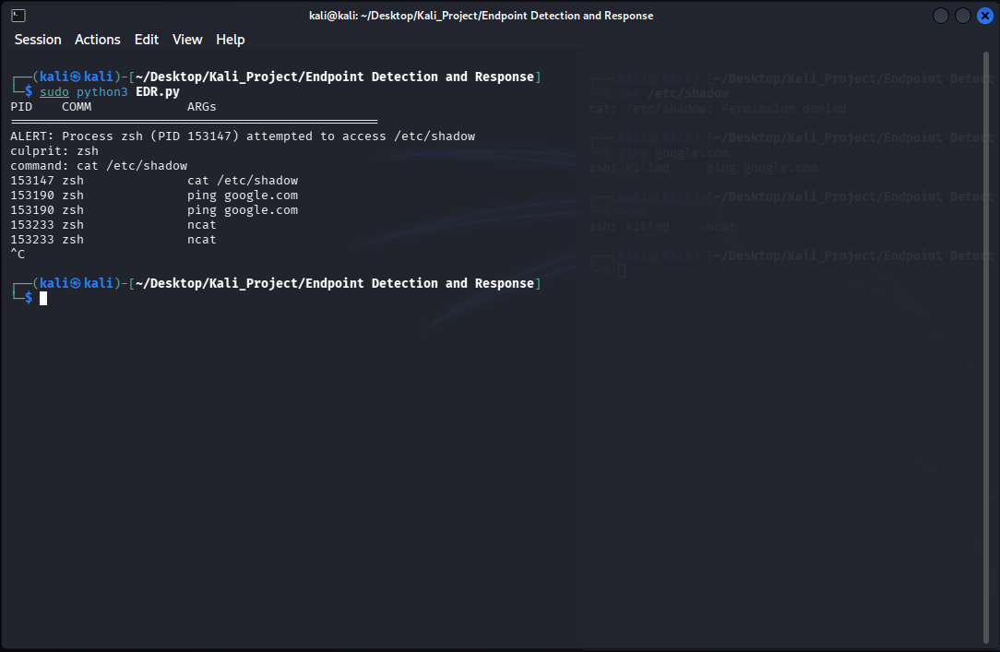

# eBPF-Based Kernel Endpoint Detection & Response (EDR)

Disclaimer!
This tool is for educational purpose only, kernel-level blocking can impact system capability if misconfigured.

# Overview

This project is a custom Endpoint Detection and Response (EDR) agent build from scratch using eBPF (Extended Berkeley Packet Filter) this EDR directly hooks into Linux Kernel to observe and enforce security policies in real-time with minimal overhead.It features Deep Visibility and Active Enforcement

## Key Features

### 1. Kernel-Level Telemetry

* Directly hooks into the `sys_enter_execve` tracepoint to capture every process execution.
* Capable of reading `argv` arrays directly from user memory

### 2. Active Blocking

* Implements `bpf_send_signal()` helper to terminate processes immediately upon detection.
* Malicious processes (like `ncat` or `ping` that i implements here) are killed directly by the kernel itself before they can established any connection.

### 3. Tamper Resistance

* The detection logic runs inside the kernel,making it invisible to standard user-space evasion techniques.

## Architecture

1. **Kernel Space (C):**

   - A BPF program attaches to the `execve` tracepoint.
   - Reads process metadata (PID, PPID, Comm, Argv).
   - Performs string comparison logic to identify threats.
   - Enforces blocking via `SIGKILL` (Signal 9).
   - Submits events to user space via a Perf Ring Buffer.

2. **User Space (Python/BCC):**

   - Loads BPF bytecode into the kernel.
   - Consumes ring buffer.
   - Parses raw bytes into human-readable logs.
   - Provides a real-time alerting dashboards.

## Demo & Proof of Concept

### 1. Active Blocking

Attempting to run unauthorized network tools (e.g., `ping`, `ncat`) will results in an immediate termination by the kernel

### 2. Deep Visibility

Agent captures full context, including sensitive file access attempts (e.g., accessing `/etc/shadow`).

## Prerequisites

* Linux Kernel 5.3+
* BCC Tools & Python bindings.
* Root privileges

---
* Created by : Yustinus Hendi Setyawan
* Date : Friday, January 12 2026